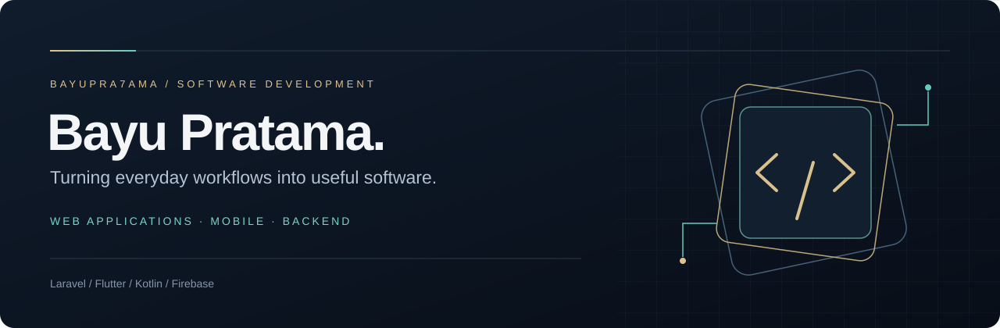

  

  
  
  

# Bayu Pratama Agus Kurniawan

**Software Developer · Web & Mobile Applications · Bengkalis, Indonesia**

Building practical applications with Laravel, Flutter, Kotlin, and Firebase.

I'm **Bayu Pratama Agus Kurniawan**, a developer working across web applications, Android, and Flutter. My projects explore how software can support everyday operations—from sales and school monitoring to public services and location-based mobile experiences.

I work with **Laravel** for web applications and backend services, **Kotlin** and **Flutter** for mobile development, and **Firebase** for authentication and application data. My portfolio brings together business applications, education tools, public-service workflows, and Android development.

 

## Development focus

| Web & backend | Mobile applications | Applied integrations |
| :--- | :--- | :--- |
| Laravel applications, APIs, dashboards, and administrative workflows. | Android with Kotlin and cross-platform applications with Flutter. | Authentication, email and WhatsApp OTP, maps, and data-driven features. |

 

## Selected projects

<table>
<tr>
<td width="50%" valign="top">

#### MUDAH CATAT
**Sales & business records**

A Flutter cashier application for recording sales, managing products and customer debts, and generating reports. Includes Firebase integration and device biometric verification.

**Flutter · Dart · Firebase**

[Explore project →](https://github.com/bayupra7ama/kasir-biomentrik)

</td>
<td width="50%" valign="top">

#### SpotGacor
**Location-based Android application**

An Android application for discovering fishing locations, connecting a Kotlin mobile experience with a Laravel backend, Firebase authentication, and Google Maps.

**Kotlin · Laravel · Firebase · Maps**

[Android app →](https://github.com/bayupra7ama/SpotGacor) &nbsp; [Backend →](https://github.com/bayupra7ama/SpotGacorBackEnd)

</td>
</tr>
<tr>
<td width="50%" valign="top">

#### School Habit Monitoring
**Parent & teacher collaboration**

A school monitoring website for tracking student habits, sharing learning materials, and exchanging feedback between parents and teachers, with WhatsApp OTP integration.

**Laravel · WhatsApp OTP**

[Explore project →](https://github.com/bayupra7ama/monitoring-7KAIH-sekolah)

</td>
<td width="50%" valign="top">

#### Lapor Infra
**Infrastructure reporting chatbot**

An auto-reply chatbot project for reporting network issues at Pekanbaru government offices, developed during an internship at the city's communication and informatics department.

**Laravel · Chatbot integration**

[Explore project →](https://github.com/bayupra7ama/chatbot_autoreplay_with_laravel)

</td>
</tr>
</table>

<strong>More work — commerce, education, and applied machine learning</strong>

 

| Project | Focus | Repository |
| :--- | :--- | :--- |
| Jastip E-commerce | A Laravel storefront for personal shopping products. | [View project](https://github.com/bayupra7ama/jastip-ecommerce) |
| Tuition Reduction Classification | A Laravel application connected to an R API using the C5.0 classification algorithm. | [Web application](https://github.com/bayupra7ama/klasifikasi-pengurangan-ukt) · [R API](https://github.com/bayupra7ama/klasifikasi-pengurangan-menggunanakan-model-C50-ukt-api) |
| Final Project Monitoring | A mobile and backend project for academic final-project monitoring. | [Mobile](https://github.com/bayupra7ama/monitoring-ta) · [Backend](https://github.com/bayupra7ama/monitoring-ta-mobile) |

 

## Technologies I work with

  
  
  
  
  
  
  
  

**Also explored:** R and C5.0 classification, Python and Selenium, and integrations between mobile applications and web APIs.

 

## Contact

Interested in discussing a web application, mobile experience, or a project in this portfolio? Connect with me on [LinkedIn](https://www.linkedin.com/in/bayu-pratama-agus-kurniawan-770798309/) or [Instagram](https://www.instagram.com/bayupra7ama/).

**GitHub:** [@bayupra7ama](https://github.com/bayupra7ama) · **Name:** Bayu Pratama Agus Kurniawan

You can also explore my [public repositories](https://github.com/bayupra7ama?tab=repositories) for source code and implementation details.

---

  <strong>BAYU PRATAMA AGUS KURNIAWAN</strong> Web applications. Mobile experiences. Practical software.

